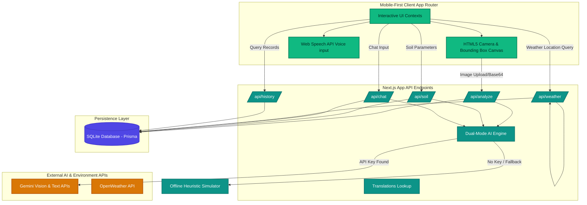

# AgriVision AI – Agriculture & Environment Intelligence Assistant

AgriVision AI is a mobile-first, production-ready, explainable AI assistant designed for farmers, gardeners, agricultural students, officers, and environmental stakeholders. It provides real-time crop disease detection, pest identification, soil health diagnostics, weather-based farming guidance, and interactive chat support in **English, Telugu, and Hindi**.

---

## 🏗️ Architecture Diagram



---

## 🌟 Core Features

1. **Crop Disease & Pest Diagnosis:** Upload leaves or insect photos to instantly receive disease classifications, severity alerts, organic/chemical treatment programs, and visual bounding-box highlights of affected areas.
2. **Soil Health & Nutrient Advisor:** Input soil types, color, pH level, and moisture to calculate a general Soil Health Score (0-100), view Nitrogen/Phosphorus/Potassium (NPK) balances, and receive fertilizer recommendations.
3. **Smart Irrigation Calendar:** Tracks weather conditions and soil moisture to generate a 7-day watering calendar, alerting users when to skip irrigation to save water and prevent root rot.
4. **Environment Monitoring & AQI:** Monitors local air quality indices (AQI) including concentrations of PM2.5, PM10, CO, and NO2, showing heat-stress warnings and sustainability tips.
5. **AI Advisory Chatbot:** Features direct chat answers with suggested prompt starters and integrated browser Web Speech voice-to-text inputs.
6. **Robust Explainability:** Every recommendation displays **AI Confidence levels**, **Logical Reasoning**, **Limitations**, and **Expert Warnings**.
7. **Multilingual (Telugu/Hindi):** Switch between English, Telugu, and Hindi in Settings. The entire UI updates instantly and LLM responses are automatically translated.

---

## 🛠️ Tech Stack & Configurations

- **Frontend:** Next.js 16 (App Router), React, Tailwind CSS v4, Lucide Icons, Recharts.
- **Backend:** Next.js Server API Routes.
- **Database:** Prisma ORM with local SQLite (`prisma/agri_vision.db`).
- **AI Engine Integration:** Gemini 1.5 Flash (Vision & Text capabilities via direct REST fetch).
- **Voice Input:** Web Speech API (`SpeechRecognition`).

---

## 🚀 Getting Started

### Prerequisites
- Node.js v18.0.0+
- npm v9.0.0+

### Installation

1. Clone or navigate into the directory:
   ```bash
   cd c:\Users\thala\OneDrive\Desktop\b6
   ```

2. Install dependencies:
   ```bash
   npm install
   ```

3. Setup local SQLite database:
   ```bash
   npx prisma db push
   ```

4. Run development server:
   ```bash
   npm run dev
   ```
   Open [http://localhost:3000](http://localhost:3000) in your browser.

### 🔑 API Key Configurations (Optional)

By default, the application runs on a **Dual-Mode AI Engine**. If no keys are specified, it activates the **Offline Emulator Mode**, producing rich, structured mock predictions (e.g. Tomato Late Blight, Aphids, Sandy soil suitabilities) complete with bounding boxes.

To connect live AI:
1. Open the **Settings Screen** in the app and paste your **Gemini API Key**.
2. Or, create a `.env.local` file at the root:
   ```env
   GEMINI_API_KEY=AIzaSy...
   ```

---

## 📑 API Documentation

### 1. Image Analysis API
* **Endpoint:** `POST /api/analyze`
* **Request Body:**
  ```json
  {
    "image": "data:image/jpeg;base64,...",
    "type": "disease" | "pest" | "waste",
    "lang": "en" | "te" | "hi",
    "keys": { "gemini": "optional_user_key" }
  }
  ```
* **Response Output:**
  ```json
  {
    "id": "record-uuid",
    "itemName": "Tomato Late Blight (Phytophthora infestans)",
    "confidence": 94.5,
    "severity": "High",
    "explanation": "Disease summary...",
    "reasoning": "Detected spots...",
    "observations": "Water-soaked lesions",
    "recommendations": ["Prune leaves", "Apply copper spray"],
    "preventionTips": ["Rotate crops"],
    "limitations": "Advisory text...",
    "expertWarning": "Certified specialist alert...",
    "boundingBoxes": [
      { "x": 15, "y": 20, "width": 35, "height": 40, "label": "Lesion" }
    ],
    "createdAt": "2026-06-11T..."
  }
  ```

### 2. Soil Health API
* **Endpoint:** `POST /api/soil`
* **Request Body:**
  ```json
  {
    "soilType": "Loamy Soil",
    "soilColor": "Dark Brown",
    "pH": 6.5,
    "moisture": 35,
    "cropType": "Maize",
    "lang": "en",
    "keys": { "gemini": "optional_key" }
  }
  ```
* **Response Output:**
  ```json
  {
    "id": "soil-uuid",
    "healthScore": 90,
    "nutrients": {
      "nitrogen": "Optimal",
      "phosphorus": "Optimal",
      "potassium": "Optimal",
      "organicMatter": "High"
    },
    "fertilizers": ["Apply compost"],
    "suitability": ["Maize", "Tomatoes"],
    "improvements": ["Practice crop rotations"],
    "reasoning": "pH is within healthy bounds...",
    "limitations": "Laboratory test recommended...",
    "expertWarning": "Submit core sample..."
  }
  ```

### 3. Weather & Air Quality API
* **Endpoint:** `POST /api/weather`
* **Request Body:**
  ```json
  {
    "location": "Hyderabad, IN",
    "lang": "te"
  }
  ```
* **Response Output:**
  ```json
  {
    "temp": 32.4,
    "humidity": 55,
    "windSpeed": 14.2,
    "rainfallChance": 10,
    "aqi": 110,
    "conditions": "Hazy Sunshine",
    "advisories": {
      "irrigation": "Schedule normal watering...",
      "fertilizer": "Calm skies. Ideal spraying conditions..."
    },
    "irrigationSchedule": [
      { "day": "Monday", "needed": true, "amountMm": 12, "tip": "Drip irrigation" }
    ]
  }
  ```

### 4. AI Advisory Chat API
* **Endpoint:** `POST /api/chat`
* **Request Body:**
  ```json
  {
    "message": "Why are my leaves turning yellow?",
    "history": [
      { "role": "user", "text": "Hello" },
      { "role": "ai", "text": "Hello, how can I assist?" }
    ],
    "lang": "en"
  }
  ```
* **Response Output:**
  ```json
  {
    "content": "Yellow leaves typically signify nitrogen deficiency...",
    "confidence": 88.0,
    "limitations": "Requires soil testing to confirm...",
    "expertWarning": "Consult a local agronomist if symptoms spread..."
  }
  ```
